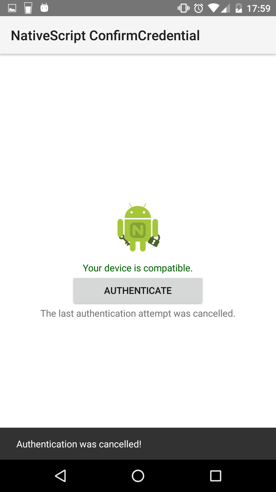

# NativeScript Android ConfirmCredential sample

## Overview

A sample NativeScript project that demonstrates how to use Android's device credentials (PIN, Pattern, Password or Fingerprint) in your {N} app.
This sample follows [the original Java implementation by Google](https://github.com/googlesamples/android-ConfirmCredential).
The project is meant to be run **only on Android devices**, that's why no platform checks are made anywhere in the code.
In order to support iOS, you should take care of invoking Android/Java specific APIs only when you have checked that you are in an Android environment.
The app is written in vanilla JavaScript, but the concepts apply to all other NativeScript flavours (TS and Angular2).

## Purpose

The idea behind this project is for me to take a closer look into the amazing capabilities of NativeScript when it comes to accessing native APIs (in this case Android/Java).
It's fascinating how well JavaScript and Java cooperate inside NativeScript's runtime. There is still a lot for me to learn, but my first impressions are very possitive.
I want to bring this project further and develop a NativeScript plugin which encapsulates the Android credentials APIs used in this sample as a standalone and ready to use module.

## Running the project

### Prerequisites
- NativeScript 2.1.0
- Android device or emulator (preferably with Marshmallow 6.0.1 OS)
- You have to set up a locking screen in order for the credential APIs to work

### Deploy the project
First add the platform specific Android files.
```
$ tns platform add android
```
Then connect a device or start an emulator.
```
$ tns platform run android
```

## Screnshots





## Known limitations
You need a device with API level 23+ in order to see the full functionality.
I have tested the project on a Lollipop 5.1.1 device and saw that the ```AndroidKeyStore``` does not support the crypto algorithms used in the example.
The Android developer documentation confirms this.
This results in the inability to initialize an AES key generator and thus failing to detect when was the user last authenticated.
However, it's still possible to respond properly to the callbacks of the ```ConfirmDeviceCredential``` activity and check if the user provided valid credentials or cancelled the action.